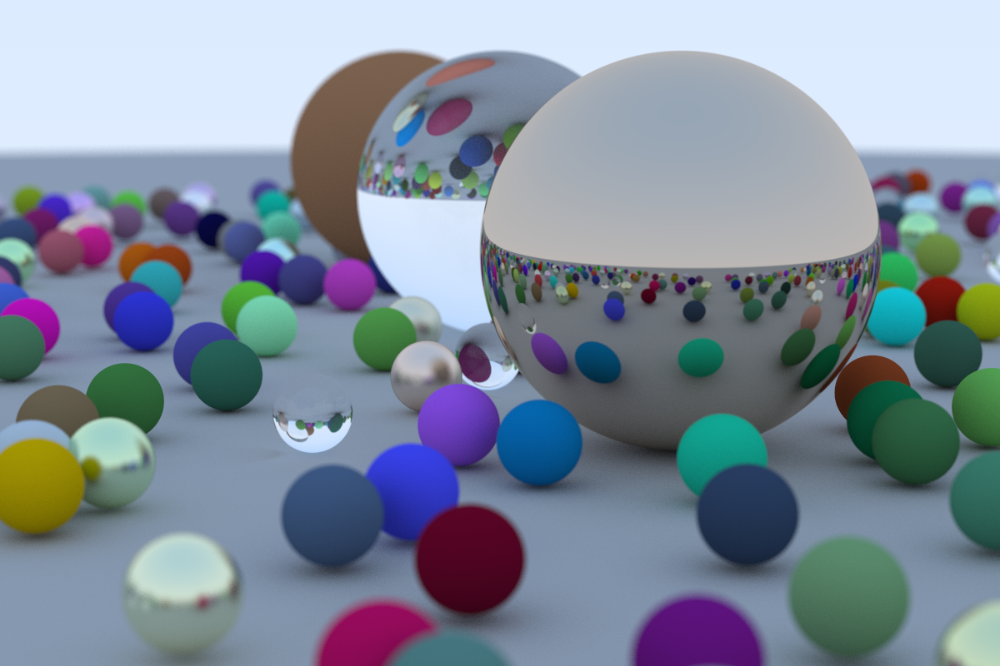

# ParRay
Currently the ray tracer works serially. 
To compile and run, the following commands can be executed:
```bash
cd src
mkdir build
cd build
cmake ..
make
./tracer_marble_single_threaded > img.ppm
```
This will produce a ```ppm``` image that can be viewed using tools such as feh. The raytracer produces the image below.



# Running the program
The binaries are output to build/bin folder.
## Generating a random scene
```bash
cd build/bin
./gen_random_scene
```
The above command will output a json ```.data``` file, which can be fed into the algorithm.
## Running single threaded BVH on the generated data file
```bash
cd build/bin
./sphere_bvh_single_threaded /path/to/scene_file
```
## Running multi-threaded BVH on the generated data file
To run on 6 processes with 4 threads per process.
```bash 
mpiexec -np 7 --bind-to none ./bin/bvh_mpi random_spheres_scene.data 4 > img.ppm
```
Note that 7 processes are created in the above example. This is because an extra process is created for the load balancing mechanism
that dynamically dispatches work to the other MPI processes that are executing the render. The process that runs the load balancing
mechanism runs in a single thread. So 6 processes are created, each executing the render using 4 threads for a total of 24 worker threads, while
the 7th process distributes work to the other processes.
## Running bench mark
```bash
./build/bin/bm_ray_tracing
```

## Run on Campus Cluster
Need to set up singularity image, see procedure under Environment Setup
```bash
#has to be in the root directory of ParRay i.e. at level where you see ./src, ./README.md
#make sure you have the singularity container set up.
qsub ./scripts/batch_script_full.slurm
```

# Environment Setup
The unit test requires CMake version at least 3.11 to run, due to the FetchContent() module.

To install CMake newest version on Ubuntu follow 
https://askubuntu.com/a/865294

The above process may need to install ```openssl``` and ```pkg-config```
Use the following commands to install them
```
sudo apt install pkg-config
sudo apt install libssl
``` 

### Google benchmark environment setup
To install google benchmark in ubuntu run the following command
```
sudo apt-get update
sudo apt-get install libbenchmark-dev
```

### Campus Cluster Environtment setup
On campus cluster
```bash
module load singularity
cd ~/scratch 						    #The current scripts assume the singularity container is in ~/scratch
singularity build cs484.sif docker://cjf12harry/cs484:0.0.2 #build a singularity container from docker image, we cannot reuse the course container due to old cmake version
```

To test the set up, use the provided light script

```bash
cd ParRay
qsub ./scripts/batch_script_light.slurm
```

